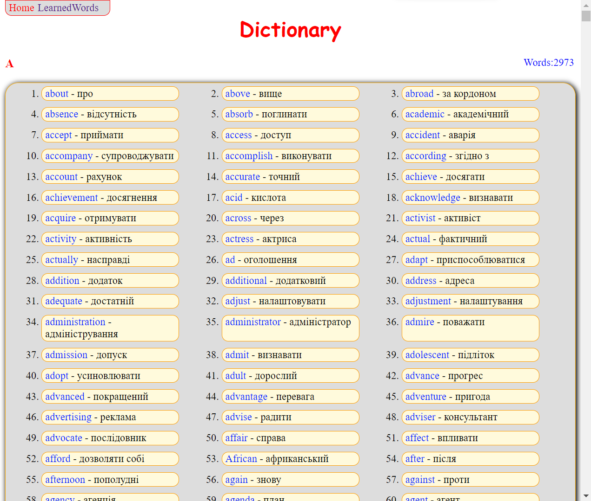

# Weather
>Hello, my name is **Sergey**!
 This web application is a simple dictionary of 3000 words with the ability to save a learned word in **a list of saved words** and automatically remove this word from the dictionary.

# Basic functions
* **Saving words**: The application provides an opportunity to save the learned word to the list of learned words

### Tech stack
* [X] **React**: *JavaScript-library* for building user interfaces.
* [X] **Vite**: Fast and advanced web application development tool.
* [X] **React Router**: Library for navigating and managing pages in *React* applications.
___
[Link to this *dictionary*](https://rss-777.github.io/dictionary/)

___
### Screenshot

